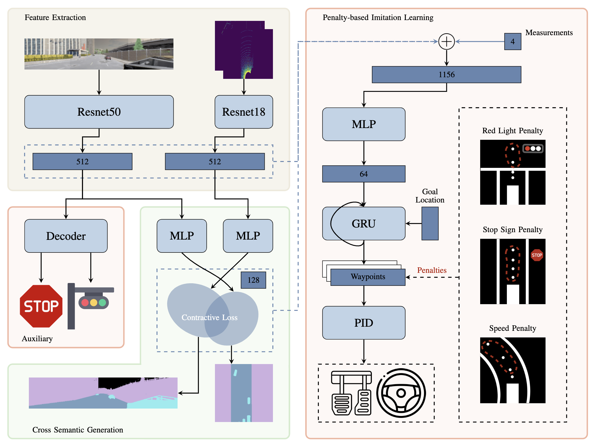
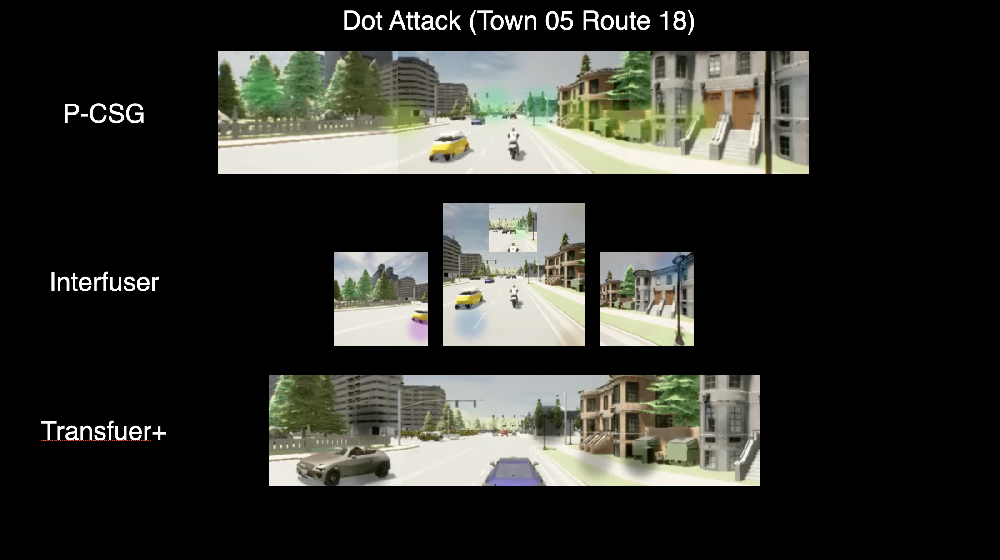
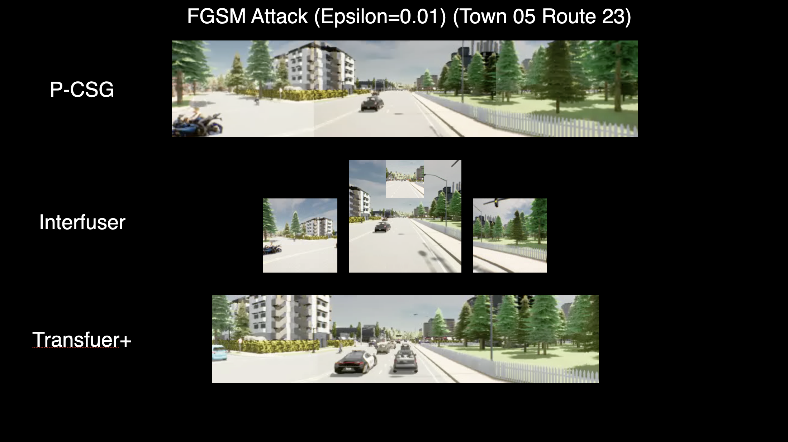

# What Matters to Enhance Traffic Rule Compliance of Imitation Learning for Automated Driving

## [Paper](https://arxiv.org/abs/2309.07808) | [Project Page](https://hk-zh.github.io/p-csg-plus/)

 

## Contents
1. [Setup](#setup)
2. [Dataset](#dataset)
3. [Data Generation](#data-generation)
4. [Training](#training)
5. [Evaluation](#evaluation)
6. [Acknowledgements](#acknowledgements)

## Setup
Install anaconda
```Shell
wget https://repo.anaconda.com/archive/Anaconda3-2020.11-Linux-x86_64.sh
bash Anaconda3-2020.11-Linux-x86_64.sh
source ~/.profile
```

Build the environment

```Shell
conda create -n P_CSG python=3.7
conda activate P_CSG
pip3 install -r requirements.txt
cd leaderboard
pip3 install -r requirements.txt
```

Download and setup CARLA 0.9.10.1
```Shell
chmod +x setup_carla.sh
./setup_carla.sh
```

## Dataset
The data is generated with ```leaderboard/team_code/auto_pilot.py``` in 8 CARLA towns using the routes and scenarios files provided at ```leaderboard/data``` on CARLA 0.9.10.1

The collected dataset is structured as follows:
```
- TownX_{tiny,short,long}: corresponding to different towns and routes files
    - routes_X: contains data for an individual route
        - rgb_{front, left, right, rear}: multi-view camera images at 400x300 resolution
        - seg_{front, left, right}: corresponding segmentation images
        - depth_{front, left, right}: corresponding depth images
        - lidar: 3d point cloud in .npy format
        - birdview: topdown segmentation images required for training LBC
        - 2d_bbs_{front, left, right, rear}: 2d bounding boxes for different agents in the corresponding camera view
        - 3d_bbs: 3d bounding boxes for different agents
        - affordances: different types of affordances
        - measurements: contains ego-agent's position, velocity and other metadata
        - other_actors: contains the positions, velocities and other metadatas of surrounding vehicles and the traffic lights
```

## Data Generation
In addition to the dataset, we have also provided all the scripts used for generating data and these can be modified as required for different CARLA versions. The dataset is collected by a rule-based expert agent in differnet weathers and towns.

### Running CARLA Server
#### With Display
```bash
# start 8 carla servers: ip [localhost], port [20000 - 20014]
cd carla
CUDA_VISIBLE_DEVICES=0 ./CarlaUE4.sh --world-port=20000 --tm-port=20500 &
CUDA_VISIBLE_DEVICES=1 ./CarlaUE4.sh --world-port=20002 --tm-port=20502 &
CUDA_VISIBLE_DEVICES=2 ./CarlaUE4.sh --world-port=20004 --tm-port=20504 &
...
```

#### Without Display (e.g. VNC)
```bash
DISPLAY= CUDA_VISIBLE_DEVICES=0 ./CarlaUE4.sh --world-port=20000 --tm-port=20500 -opengl &
DISPLAY= CUDA_VISIBLE_DEVICES=1 ./CarlaUE4.sh --world-port=20002 --tm-port=20502 -opengl &
DISPLAY= CUDA_VISIBLE_DEVICES=2 ./CarlaUE4.sh --world-port=20004 --tm-port=20504 -opengl &
...
```


### Run the Autopilot
Generate scripts for collecting data in batches.
```bash
cd carla_data
python init_dir.py
cd ..
cd data_collection
python generate_yamls.py # You can modify fps, waypoints distribution strength ...

# If you don't need mixed weather, you can modify the weather setting in generate_yaml
python generate_bashs.py
python generate_batch.py 
cd ..
```
run batch_run parallel to collect the data, the data will be stored in the carla_data folder
```bash
### Clear weather ###
bash data_collection/batch_run/clear-weather/run_route0.sh
bash data_collection/batch_run/clear-weather/run_route1.sh
bash data_collection/batch_run/clear-weather/run_route2.sh
bash data_collection/batch_run/clear-weather/run_route3.sh
...

### Weather Mixed ###
bash data_collection/batch_run/weather-mixed/run_route0.sh
bash data_collection/batch_run/weather-mixed/run_route1.sh
bash data_collection/batch_run/weather-mixed/run_route2.sh
bash data_collection/batch_run/weather-mixed/run_route3.sh
...
```
### Formalize collected data 
```
cd carla_data
python organize_files # organize files
cd ..
python carla_data/prepare_light.py # prepare red lights
python carla_data/prepare_stopsign.py # prepare stop signs
python team_code/data_processing.py # precessing data and make training faster
```

## Training
To train the model, please run the following code
```Shell
CUDA_VISIBLE_DEVICES=0 python3 team_code/train.py 
```
The important training arguments we have are following:
```
--id: Unique experiment identification
--device: training device to use
--epoch: the number of train epochs
--lr: learning rate
--val_every: validation frequence
--bacth_size: batch size
--logdir: the directory to log data (checkpoints, arguments information)
--lambda1: the weight of red light penalty
--lambda2: the weight of speed penalty
--lambda3: the weight of stop sign penalty
```

## Evaluation
Spin up a CARLA server (described above) and run the required agent. The adequate routes and scenarios files are provided in ```leaderboard/data``` and the required variables need to be set in ```leaderboard/scripts/run_evaluation.sh```.

```
CUDA_VISIBLE_DEVICES=0 ./leaderboard/scripts/run_evaluation.sh  <carla root> <working directory>
```

## Dot Attack




Above shows the results of dot attack of PCSG, Interfuser and Transfuser+.

### PCSG Dot Attack
To train the dot of the dot attack, you can run the code 

```bash
python3 team_code/dot_train_pcsg.py 
--name [Name of your results folder]
--logdir model_ckpts/ckpt_final
--batch_size 32
```
After the traininng, the model checkpoint will be saved in the ```attack/p_csg/logs/[Name of your results folder]```. To test the results of the dot attack, you can run

```Shell
conda activate P_CSG
DISPLAY= CUDA_VISIBLE_DEVICES=0 ./CarlaUE4.sh --world-port=2002 --tm-port=8002 -opengl
```

```Shell
bash attack/p_csg/dot_attack.sh
```

Note: you need to change the directory of your carla in ```attack/p_csg/dot_attack.sh```, and also, here we use checkpoints of pretrained dot attack model by default, if you trained the model yourself, and want to use your own checkpoint, you need to change the directory of checkpoint in the script ```leaderboard/leaderboard/agents/p_csg_dot_attack.py (line 265)```

### Interfuser Dot Attack
To train the dot of the dot attack of Interfuser, please implement Interfuser and run the following script

```bash
python3 attack/InterFuser/interfuser/dot_train_interfuser_loss_attack.py

```
To test the results of the dot attack, you can use the agent

```Shell
attack/interfuser/agents/interfuser_agent_dot_attack.py
```

We provide the pretrained checkpoint in ```attack/interfuser/dot_ckpt```

### Transfuser+ Dot Attack
To train the dot of the dot attack of Interfuser, please implement Transfuser+ and run the following script

```bash
python3 attack/transfuserp/dot_train_transfuserp_loss_attack.py

```
To test the results of the dot attack, you can use the agent

```Shell
attack/interfuser/agents/transfuserp_agent_dot_attack.py
```

We provide the pretrained checkpoint in ```attack/transfuserp/dot_ckpt```


## FGSM Attack



Above shows the results of FGSM attack. Due to the low magnitude of the adversarial perturbation, distinguishing original from attacked one poses a challenge to human visual perception. This is also an advantage of FGSM attack.

### PCSG FGSM Attack

To test the FGSM attack, you can simply run
```Shell
conda activate P_CSG
DISPLAY= CUDA_VISIBLE_DEVICES=0 ./CarlaUE4.sh --world-port=2002 --tm-port=8002 -opengl
```

```Shell
bash attack/p_csg/fgsm_attack.sh
```

Note: you need to change the directory of your carla in ```attack/p_csg/fgsm_attack.sh```

### Interfuser FGSM Attack

To test the FGSM attack, you can use the agent

```Shell
attack/interfuser/agents/interfuser_agent_fgsm_attack_001.py
```
### Transfuser+ FGSM Attack

To test the FGSM attack, you can use the agent

```Shell
attack/transfuserp/agents/transfuserp_agent_fgsm_attack_001.py
```


## Ablation Study

If you want to run the attack results of Interfuser and Transfuser, please open the ```attack```, the descriptions are in corresponding folders

## Acknowledgements
This work was supported by Huawei Trustworthy Technology and Engineering Laboratory.

